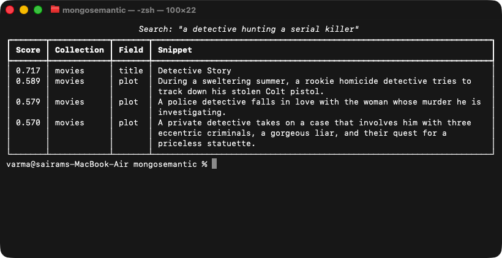
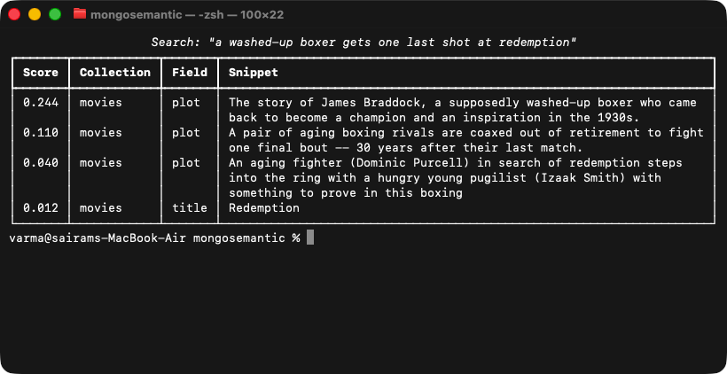
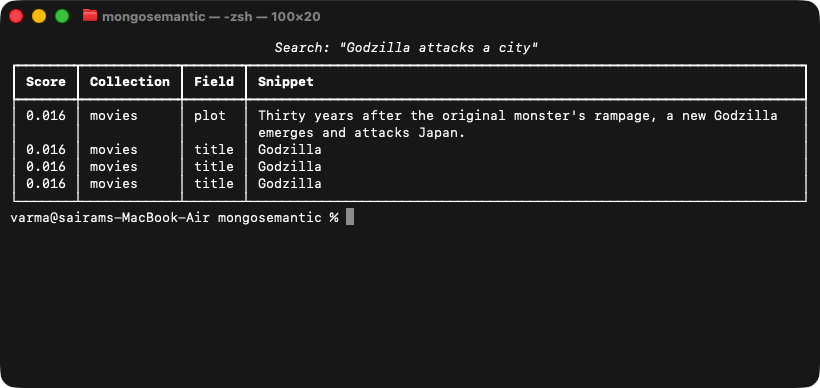

# 0.9.0 test evidence — metadata filters, rerank, hybrid everywhere

Visual proof that the three Tier 1 search-quality features work end-to-end,
captured 2026-06-10 with the [`capture`](https://github.com/varmabudharaju/capture)
tool against the live local stack (replica set `localhost:27117`, db `demo`,
movies = 23,539 docs, title+plot embedded with `local-fast`). Every shot is
reproducible: `capture run` regenerates the full set from `.capture.yaml`.

**Automated coverage behind these shots:** 341 tests passed, 5 skipped
(Atlas-gated), `ruff` clean — including 5 new end-to-end integration tests
(`tests/integration/test_tier1_search.py`) that assert filter exclusion,
empty-filter behavior, $text+vector fusion, filter-inside-hybrid, and real
cross-encoder ordering against the live replica set.

---

## 1. Metadata filtering

A plain MongoDB query over **source-document fields** narrows any semantic
search — no reindex, works on every search path (HNSW/brute-force pre-filter
exactly; Atlas paths over-fetch and post-match).

The same query, *"a detective hunting a serial killer"*, constrained to
`{"year": {"$lt": 1960}}` — every hit is a pre-1960 classic (*Detective
Story* 1951, *The Maltese Falcon*-era noir), and the modern serial-killer
films that top the unfiltered search are gone:


Same feature on the CLI:



## 2. Local cross-encoder reranking

`--rerank` / the web toggle over-fetch limit×5 candidates and re-score each
(query, chunk) pair with `cross-encoder/ms-marco-MiniLM-L-6-v2` locally. Note
the **Reranked** badge on every row, the sigmoid-scale scores (0.244 → 0.002),
and the score bars normalized per result set (the old UI rendered small-scale
scores as invisible 1-px bars):


CLI: the cross-encoder ranks the James Braddock plot (an actual washed-up-boxer
redemption story) decisively first:



## 3. Hybrid search on a self-hosted replica set (no Atlas)

Previously Atlas-only. Now the keyword leg is a classic Mongo `$text` index on
the shadow's chunk text, fused with the vector leg via client-side RRF
(1/(60+rank), 0.6/0.4 — the same weighting as Atlas `$rankFusion`). Scores in
the ~0.016 RRF range render correctly thanks to the normalized bars. The
Hybrid toggle is on and the topology is the local replica set:


CLI, same topology — the keyword leg anchors on "Godzilla", the vector leg
adds the meaning-only match:



---

## How these were captured

```bash
capture run            # boots `mongosemantic ui`, waits for "HNSW warmup finished",
                       # captures all 22 shots (web via Chromium, CLI via real Terminal)
```

Shot definitions: [.capture.yaml](../.capture.yaml) (shots 17–22 are the 0.9.0
additions). The full 22-shot set also re-verified that the pre-0.9 pages
(connection, collections, indexing, dashboard, MCP, apply, migrate) still
render correctly with the new code.
